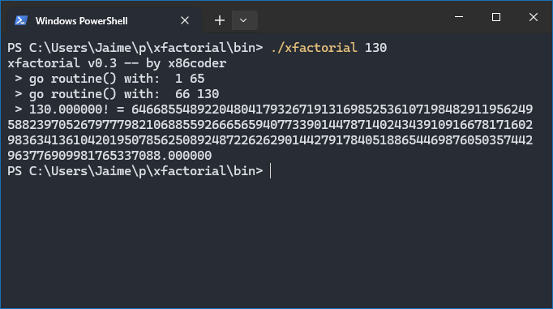

# xfactorial (n)

Sample code with Golang to use multiple threads to distribute the work along processor cores.

## Usage
- Run application as **xfactorial {number}**

## Installation
- Install [go](https://go.dev/) language
- Run `go build`
- Run `xfactorial 20`

## Download
- Optionally you can download windows .exe file from `\bin` folder.